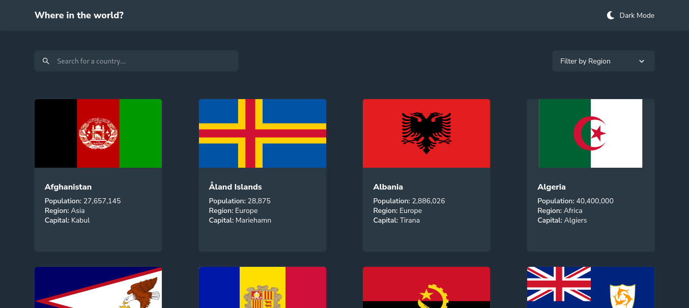

# Frontend Mentor - REST Countries API with color theme switcher solution

This is a solution to the [REST Countries API with color theme switcher challenge on Frontend Mentor](https://www.frontendmentor.io/challenges/rest-countries-api-with-color-theme-switcher-5cacc469fec04111f7b848ca). Frontend Mentor challenges help you improve your coding skills by building realistic projects.

## Table of contents

- [Overview](#overview)
  - [The challenge](#the-challenge)
  - [Screenshot](#screenshot)
- [My process](#my-process)
  - [Built with](#built-with)
- [Author](#author)

**Note: Delete this note and update the table of contents based on what sections you keep.**

## Overview

### The challenge

Users should be able to:

- See all countries from the API on the homepage
- Search for a country using an `input` field
- Filter countries by region
- Click on a country to see more detailed information on a separate page
- Click through to the border countries on the detail page
- Toggle the color scheme between light and dark mode _(optional)_

### Screenshot

### Links

- Solution URL: [Solution URL](https://www.frontendmentor.io/solutions/react-nLLmfdlVl)
- Live Site URL: [Live site URL](https://country-getter.netlify.app)

## My process

### Built with

- Flexbox
- [React](https://reactjs.org/) - JS library

## Author

- Website - [Samuel Lawal](https://github.com/samurai1979)
- Frontend Mentor - [@samurai1979](https://www.frontendmentor.io/profile/samurai1979)
- Twitter - [@samurai_lawal](https://www.twitter.com/samurai_lawal)
